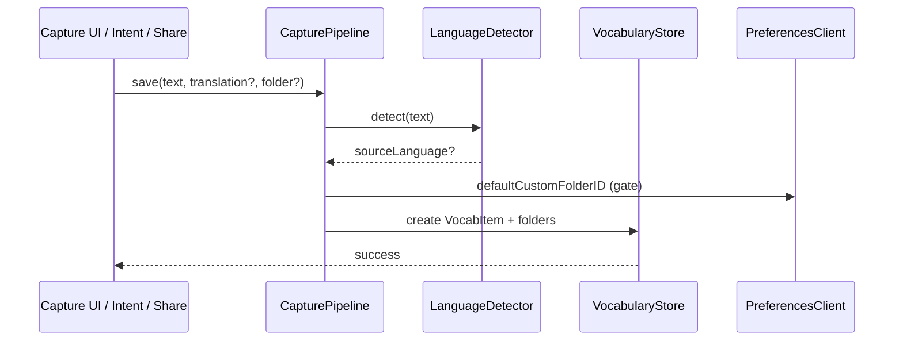

# Stage 8 — Architecture

**Status:** Accepted — module layout, repo structure, and TCA organization. Built from accepted `docs/technical-design.md` and owner decisions. Drives Increment Planning (Stage 9).

**Refs:** `docs/technical-design.md`, `docs/feature-breakdown.md`, `docs/domain-modeling.md`

---

## Why this stage

Technical Design chose the stack. Architecture defines **where code lives**, **what depends on what**, and **how TCA features compose** — so implementation increments have a stable map and extensions stay thin.

---

## Locked decisions (owner)

| Area | Choice |
|---|---|
| **SPM packages** | **GlimpseCore** + **GlimpseAI** + **GlimpseFeatures** (TCA) |
| **Package location** | `Packages/` at Glimpse repo root |
| **App Group** | `group.<bundle-id>` (standard pattern; exact ID follows app bundle ID) |
| **`example` storage** | **Codable transform** on `VocabItem` (`[String]` ↔ stored `Data`) |
| **Share Extension** | **SwiftUI sheet** — pre-filled text + optional translation + Save |
| **Related items cap** | **20** on card detail |
| **GlimpseFeatures layout** | **One folder per screen feature** (shared SwiftUI lives here until a UI package is justified) |
| **Navigation owner** | **`AppFeature`** — `NavigationStack` path + resume-on-launch |
| **OpenAI retry** | **1 retry** on transient failure, then surface error to user |
| **GlimpseCore layout** | **By concern** — `Models/`, `Store/`, `Services/`, `Clients/` |

### Package dependency rule

```
Glimpse (app)     → GlimpseFeatures, GlimpseAI, GlimpseCore
GlimpseWidget     → GlimpseCore only
GlimpseShare      → GlimpseCore only
GlimpseFeatures   → GlimpseAI, GlimpseCore
GlimpseAI         → GlimpseCore (minimal — types for generation context only)
GlimpseCore       → (no GlimpseAI, no TCA)
```

**Rationale:** Widget/Share stay lightweight. **macOS later** reuses the same packages; only platform app shells differ.

---

## Repository layout (target)

```
Glimpse/
├── Packages/
│   ├── GlimpseCore/
│   ├── GlimpseAI/
│   └── GlimpseFeatures/
├── Glimpse/                      # iOS app — @main
├── GlimpseWidget/
├── GlimpseShare/
├── GlimpseTests/
├── GlimpseUITests/
├── Glimpse.xcodeproj
└── docs/
```

Template `Glimpse/Item.swift` is removed when Core models land.

---

## GlimpseCore

### Models/

| Type | Role |
|---|---|
| `VocabItem` | Card entity; `example` via `@Attribute(.transformable(by: …))` or equivalent Codable transformer |
| `LanguageFolder` | Auto language buckets + `unsorted` sentinel |
| `CustomFolder` | User folders |
| `SchemaV1` | Versioned schema registration |

### Store/

| Type | Role |
|---|---|
| `ModelContainerFactory` | App Group URL, shared configuration |
| `VocabularyStore` | CRUD, folder assignment, re-file, Unsorted resolve, invariant enforcement |

Single public entry for extensions: **`CapturePipeline.save(...)`** (text, optional translation, source override rules per surface).

### Services/

| Type | Role |
|---|---|
| `LanguageDetector` | `NLLanguageRecognizer` wrapper |
| `SearchService` | Global predicate search on `text` + `translation` |
| `RelatedItemsQuery` | Same language, exclude self, `createdAt` desc, **limit 20** |

### Clients/

| Type | Role |
|---|---|
| `PreferencesClient` | `lastViewedFolder*`, `defaultCustomFolderID` in App Group `UserDefaults` |

### Tests

`GlimpseCoreTests` — Swift Testing against in-memory `ModelContainer`; cover domain invariants and Unsorted resolve.

---

## GlimpseAI

Depends on **GlimpseCore** for `VocabItem` context types (or lightweight DTOs to avoid SwiftUI in AI package).

| Component | Role |
|---|---|
| `GenerationService` | Protocol: translate, example, discoverSimilar |
| `HybridGenerationService` | On-device first → OpenAI fallback |
| `FoundationModelsAdapter` | Apple on-device path *(API TBD at implementation)* |
| `OpenAIClient` | `gpt-4o-mini`; **1 retry** on transient errors |

API key read from **Keychain** only (seeded from build-time inject on first launch — see Technical Design).

`GlimpseFeatures` depends on `GenerationService` via TCA `@Dependency`.

---

## GlimpseFeatures (TCA)

External dependency: **[swift-composable-architecture](https://github.com/pointfreeco/swift-composable-architecture)** (version pinned in `Package.swift` at implementation).

### App/

| Feature | Responsibility |
|---|---|
| **`AppFeature`** | Root state: `NavigationStack` path, search bar state, resume on launch via `PreferencesClient`, presents child destinations |
| **`AppView`** | Root SwiftUI: folder list chrome, search, add button |

### Screen features (one folder each)

| Folder | Feature | Feature IDs |
|---|---|---|
| `FolderList/` | `FolderListFeature` | F3.1, X3 |
| `FolderDetail/` | `FolderDetailFeature` | F3.1, F3.3, F2.2, F5.1 entry |
| `CardDetail/` | `CardDetailFeature` | F4.x, F2.3, F2.4 |
| `Capture/` | `CaptureFeature` | F1.1, F2.5 |
| `Study/` | `StudyFeature` | F5.x |

Each folder contains: `*Feature.swift` (Reducer), `*View.swift`, optional `*State` helpers.

### Navigation model (`AppFeature`)

```text
Path elements (illustrative):
  .folderDetail(FolderID)
  .cardDetail(VocabItemID)
  .study(StudyScope)
```

- **Resume:** on `AppFeature` `.onAppear`, read `PreferencesClient` → push `folderDetail` or stay at root.
- **Study:** pushed scope carries folder ID or search result IDs — no standalone Study tab.
- **Capture:** sheet presented from `AppFeature` / `FolderListFeature` (not a stack push).

Child features communicate via actions bubbled to `AppFeature` or `@Shared` state only where necessary — prefer explicit delegate actions over global stores.

### Dependencies (TCA)

Registered in app target `GlimpseApp` / test hosts:

| Dependency | Live | Test |
|---|---|---|
| `vocabularyStore` | `VocabularyStore` | in-memory store |
| `generationService` | `HybridGenerationService` | `.mock` / recorded |
| `languageDetector` | `LanguageDetector` | fixed locales |
| `preferencesClient` | App Group defaults | ephemeral |

---

## App & extension targets

### Glimpse (main app)

- `@main` → `AppView` with `Store(initialState: AppFeature.State()) { AppFeature() }`
- Links: **GlimpseFeatures**, **GlimpseAI**, **GlimpseCore**
- Entitlements: App Group, Keychain access groups if needed

### GlimpseWidget

- WidgetKit + **App Intent** for Quick note capture
- Links: **GlimpseCore** only
- Intent calls `CapturePipeline.save` — same rules as PRD (default folder gate, no pickers)

### GlimpseShare

- **SwiftUI** `ShareViewController` / `ShareExtensionView`
- Pre-filled shared text, optional translation, Save
- Links: **GlimpseCore** only

---

## Entitlements checklist

Apply to all targets that need shared data:

| Entitlement | Targets |
|---|---|
| App Groups: `group.<bundle-id>` | Glimpse, GlimpseWidget, GlimpseShare |
| Keychain Access Groups (if sharing key) | Glimpse only (extensions don't call OpenAI in v1) |

`ModelContainer` and `UserDefaults` both use the **same** App Group suite name.

---

## Data flow (capture)



---

## Resolved from Technical Design open items

| Item | Resolution |
|---|---|
| SPM boundaries | GlimpseCore / GlimpseAI / GlimpseFeatures (this doc) |
| Share Extension | SwiftUI sheet confirmed |
| `example` `[String]` | Codable transform on `VocabItem` |
| Related-items cap | 20 |
| OpenAI retry | 1 retry then error |
| App Group pattern | `group.<bundle-id>` |

---

## Open items (implementation)

- [ ] **Exact bundle ID** — set in Xcode; App Group becomes `group.<that-bundle-id>`.
- [ ] **Foundation Models adapter** — confirm iOS 26 SDK API; stub until device/SDK available.
- [ ] **TCA version pin** in `GlimpseFeatures/Package.swift`.
- [ ] **Codable transformer** implementation for `example` — verify SwiftData transformable API on iOS 26.
- [ ] **Widget App Intent** parameter design (text field limits, translation optional).
- [ ] **Delete item** UI placement (card detail vs swipe on list) — product already allows delete; UI detail deferred.
- [ ] **macOS target** — out of v1; `GlimpseFeatures` kept platform-neutral where possible (`#if os` only in app shells).

---

## Non-goals (this stage)

- Increment order and milestones — Stage 9.
- CI/CD, Fastlane, TestFlight — Stages 11–12.
- Pixel-level UI — Stage 13.

---

## Definition of Done (Stage 8)

- [x] Three-package split with dependency graph.
- [x] Repo folder layout and per-package internal structure.
- [x] TCA feature map aligned to feature-breakdown IDs.
- [x] AppFeature owns navigation + resume.
- [x] Extension targets scoped to GlimpseCore.
- [x] Entitlements checklist stated.
- [x] Technical Design open items resolved or carried forward explicitly.
- [x] Owner review — accepted.
- [x] Proceed to Stage 9 — Increment Planning.
