# Stage 6 — Feature Breakdown

**Status:** Accepted — implementable features derived from accepted product docs. No frameworks, types, or API choices — that's Stage 7 (Technical Design). Drives Technical Design and Increment Planning below.

---

## Why this stage

Stages 1–5 define *what* and *why*. Feature Breakdown turns that into a **checklist of deliverable capabilities** — each with acceptance criteria, touched screens, domain rules, and dependencies — so Technical Design and Increment Planning can size work without re-reading every prior doc.

---

## How to use this doc

- **Feature ID** — stable reference for increments, issues, and Technical Design sections.
- **Acceptance criteria** — testable without prescribing implementation.
- **Depends on** — must exist (or ship in the same increment) before this feature works end-to-end.
- **Refs** — PRD §, user flow, IA screen, domain entity/invariant. Details live there; this doc does not redefine them.

---

## Feature map (by hero loop)

```mermaid
flowchart LR
  subgraph capture [Capture]
    C1[In-app capture]
    C2[Widget]
    C3[Share Extension]
    C4[Language detection]
  end
  subgraph organize [Organize]
    O1[Language folders]
    O2[Custom folders]
    O3[Re-file]
    O4[Unsorted resolve]
    O5[Default folder pref]
  end
  subgraph find [Find]
    F1[Folder browse]
    F2[Global search]
    F3[Shuffle]
    F4[Resume]
  end
  subgraph card [Card]
    K1[Card detail]
    K2[Related items]
    K3[AI generation]
  end
  subgraph study [Study]
    S1[Study deck]
  end
  capture --> organize
  organize --> find
  find --> card
  find --> study
  card --> capture
```

---

## Cross-cutting platform features

### X1 — Local vocabulary store

**User value:** All items and folders persist on device; core loop works offline.

| | |
|---|---|
| **Surfaces** | All app targets that read/write vocabulary |
| **Domain** | Item, Language Folder, Custom Folder; all invariants |
| **Refs** | PRD NFR (single-user/local, offline-first); domain §Invariants |

**Acceptance criteria:**
- [ ] Create, read, update, delete Items and Custom Folders locally with no account.
- [ ] Language folders appear automatically when first needed (including Unsorted).
- [ ] Widget and Share Extension write to the same store the main app reads (shared container — mechanism deferred to Technical Design).
- [ ] Core loop (capture, browse, search, study, related items) works with airplane mode on; AI features may fail independently (X2).

**Depends on:** — (foundation)

---

### X2 — On-demand AI generation (behavior)

**User value:** Translation, examples, and discover-similar on explicit tap only; app stays usable when AI is unavailable.

| | |
|---|---|
| **Surfaces** | Card detail (F4.x); discover-similar save reuses capture pipeline (F1.1) |
| **Domain** | Invariants 6, 10; translation/example fields; discover-similar → new Item |
| **Refs** | PRD §4, §6; Flow 4; domain §Relationships |

**Acceptance criteria:**
- [ ] Nothing generates on load, on save, or in the background — button press only.
- [ ] **Translation** and **discover similar:** multiple candidates; user picks one before persist.
- [ ] **Example:** single result saved directly to `example` as `[String]`; replaces prior list.
- [ ] **Gate:** translation, example, and discover-similar generation require non-null `sourceLanguage`; manual translation/example entry still works on Unsorted cards.
- [ ] Failure (offline, error, timeout) shows clear feedback; rest of card and app remain usable.
- [ ] On-device vs cloud — Technical Design only; behavior above is fixed.

**Depends on:** X1, F4.1

---

### X3 — App navigation shell

**User value:** Predictable single-stack navigation; Study never a top-level tab.

| | |
|---|---|
| **Surfaces** | Entire main app |
| **Refs** | IA §Navigation model; PRD §5; Flow 3 |

**Acceptance criteria:**
- [ ] No `TabView` / tab bar in v1.
- [ ] Root = folder list; folder detail, card detail, study deck pushed on stack.
- [ ] One in-app capture sheet; entry from root and folder detail (folder prefills source/target when known).
- [ ] Mid-study push to card detail preserves deck session for current app session only.

**Depends on:** — (shell can ship with first screen)

---

### X4 — Resume last folder viewed

**User value:** Relaunch returns to where you left off in the vocabulary, not mid-study or scroll position.

| | |
|---|---|
| **Surfaces** | App launch |
| **Refs** | IA §Resume rule; Flow 3 step 1; domain Non-goals (storage mechanism → TD) |

**Acceptance criteria:**
- [ ] On cold launch, restore navigation to last opened folder detail, or root folder list if none.
- [ ] Does not restore search query text, list scroll offset, or study deck index.
- [ ] Study mid-deck state is never persisted across relaunch.

**Depends on:** X3, F3.1

---

## Capture

### F1.1 — In-app capture

**User value:** Add a word/phrase from inside the app with optional translation, languages, and folder.

| | |
|---|---|
| **Surfaces** | Root add action → capture sheet; folder detail Add → same sheet (IA §Root, §Folder detail) |
| **Domain** | Item create; default custom folder pref; folder → pending target/source prefill |
| **Refs** | PRD §1; Flow 1; IA §Root, §Folder detail |

**Acceptance criteria:**
- [ ] `text` required; translation optional; example starts blank.
- [ ] Source language auto-detected; user may override when UI allows; `null` + Unsorted if detection fails and user skips pick.
- [ ] Target language defaults to source when non-null; editable before save.
- [ ] Default custom folder prefilled when language gate matches; user can change or clear; picker filtered by pending source (including `null`).
- [ ] Selecting custom folder prefills source/target from folder when set; source locked after prefill; target still editable before save.
- [ ] Add from folder detail uses the same sheet; when the open folder has `sourceLanguage`, source (and default target) are prefilled and source locked; Unsorted / unlocked empty custom → same detection/manual rules as root.
- [ ] Save is fire-and-forget — no confirmation step; item appears in language folder (+ custom if chosen) and search index immediately.
- [ ] Saving with a custom folder updates default custom folder preference (F2.5).
- [ ] No dedup — same text creates a new Item.
- [ ] Translation never auto-generated at capture.

**Depends on:** X1, F2.1, F2.2 (empty custom folders), F2.5, F1.4

---

### F1.2 — Quick note widget

**User value:** Capture in 0–1 taps without opening the app.

| | |
|---|---|
| **Surfaces** | Home Screen widget |
| **Domain** | Item create; widget fields `text` + optional `translation`; default folder gate |
| **Refs** | PRD §1; Flow 1; IA §Capture surfaces outside the app |

**Acceptance criteria:**
- [ ] User enters `text`; optional `translation`; saves in one action.
- [ ] No folder, source, or target pickers — auto-detection + default custom folder when language matches (F2.5).
- [ ] Item visible in main app after next open (same store as X1).
- [ ] `null` detection → Unsorted; no blocking prompt.

**Depends on:** X1, F1.4, F2.5

---

### F1.3 — Share Extension

**User value:** Save highlighted text from any app in one share action.

| | |
|---|---|
| **Surfaces** | iOS Share sheet extension |
| **Domain** | Same as F1.2 |
| **Refs** | PRD §1; Flow 1; IA §Capture surfaces outside the app |

**Acceptance criteria:**
- [ ] Pre-fills shared plain text as `text`; optional translation field before save.
- [ ] Same save semantics as F1.2 (detection, default folder gate, Unsorted fallback).
- [ ] Dismisses quickly; no in-extension folder/language UI.

**Depends on:** X1, F1.4, F2.5

---

### F1.4 — Language detection at capture

**User value:** Items land in the right language folder automatically.

| | |
|---|---|
| **Surfaces** | All capture paths (F1.1–F1.3, F4.5 save) |
| **Domain** | `sourceLanguage`; Language Folder assignment; Unsorted |
| **Refs** | PRD §1–§2; domain §Item, §Language Folder |

**Acceptance criteria:**
- [ ] Runs on save for every new Item (including discover-similar save with pre-filled text only).
- [ ] Non-null result → matching language folder (create folder on first use).
- [ ] Low confidence / failure → `sourceLanguage` `null`, Unsorted folder — no blocking prompt on widget/Share.
- [ ] In-app capture may offer optional manual source pick before save.
- [ ] Detection does not run again when `text` is edited post-save.

**Depends on:** X1, F2.1

---

## Organize

### F2.1 — Language folders (auto)

**User value:** Vocabulary grouped by source language without manual setup.

| | |
|---|---|
| **Surfaces** | Root folder list, folder detail |
| **Domain** | Language Folder entity; invariant 1, 3 |
| **Refs** | PRD §2; Flow 2; IA §Root, §Folder detail |

**Acceptance criteria:**
- [ ] One built-in folder per language code used; Unsorted for `null` source.
- [ ] Listed on root (language folders first); no rename/delete UI.
- [ ] Folder detail lists Items whose `sourceLanguage` maps to that folder (Unsorted shows `null`-source items).
- [ ] Assignment at capture; change only via F2.4 Unsorted resolve.

**Depends on:** X1

---

### F2.2 — Custom folder management

**User value:** User-defined groupings on top of language folders.

| | |
|---|---|
| **Surfaces** | Root "New folder"; folder detail rename/delete (custom only) |
| **Domain** | Custom Folder; invariants 2, 8; delete cascades membership only |
| **Refs** | PRD §2; Flow 2; IA §Root, §Folder detail |

**Acceptance criteria:**
- [ ] Create folder with **name required** only; 0 items valid.
- [ ] Rename custom folder anytime.
- [ ] Delete custom folder → Items lose custom membership only; language folders unchanged.
- [ ] If deleted folder was default custom folder, clear preference (F2.5).
- [ ] `sourceLanguage` set from first Item added, then locked (including `null`); `targetLanguage` optional, synced from cards only, shown but not directly editable on folder.

**Depends on:** X1, F3.1

---

### F2.3 — Custom folder re-file

**User value:** Move an item into or out of one custom folder after capture.

| | |
|---|---|
| **Surfaces** | Card detail (non-Unsorted); optionally folder/item actions from lists |
| **Domain** | Item ↔ Custom Folder; invariant 9; card → folder target sync on add/edit |
| **Refs** | PRD §2; Flow 2 step 3; domain §Relationships |

**Acceptance criteria:**
- [ ] At most one custom folder per Item; manual assign/remove only.
- [ ] Picker shows folders with empty `sourceLanguage` or matching Item source (including `null` where allowed).
- [ ] Does not change Item `sourceLanguage`, language folder, or `targetLanguage`.
- [ ] Adding Item may set folder `sourceLanguage` (first item) and folder `targetLanguage` (from Item target).
- [ ] Re-file into a folder updates default custom folder (F2.5).
- [ ] **Not available** on Unsorted cards until F2.4 resolve used (Unsorted uses resolve path instead).

**Depends on:** X1, F2.2, F4.1, F2.5

---

### F2.4 — Unsorted resolve (once per card)

**User value:** Intentionally leave Unsorted by picking a language or custom folder — one chance per card.

| | |
|---|---|
| **Surfaces** | Card detail — Unsorted-only actions |
| **Domain** | Unsorted resolve; invariants 3, 9, 13 |
| **Refs** | PRD §2; Flow 2 step 4; Flow 4 step 1; IA §Card detail |

**Acceptance criteria:**
- [ ] Shown only when `sourceLanguage` is `null` and resolve not yet consumed.
- [ ] **Move to language folder:** user picks language → `sourceLanguage` set → language folder updated; custom folder unchanged.
- [ ] **Move to custom folder:** user picks folder → Item filed; adopts folder's locked source if set (and moves language folder); if folder empty, user picks source language as part of action.
- [ ] Does not change Item `targetLanguage`.
- [ ] After either action, Unsorted-only actions hidden permanently for that Item (even if source stays `null` — edge case).
- [ ] Not shown on non-Unsorted cards.

**Depends on:** X1, F2.1, F2.2, F4.1

---

### F2.5 — Default custom folder preference

**User value:** Repeat captures land in the same custom folder without re-picking every time.

| | |
|---|---|
| **Surfaces** | In-app capture prefilled picker; widget/Share silent apply |
| **Domain** | Default custom folder rules; language gate |
| **Refs** | PRD §1–§2; domain §Default custom folder |

**Acceptance criteria:**
- [ ] Tracks last folder used at capture/re-file or manually chosen on add view.
- [ ] In-app add: prefilled when folder source empty or matches pending source (including `null`).
- [ ] Widget/Share: applied on save when gate matches; otherwise no custom folder.
- [ ] Cleared when that folder is deleted.
- [ ] Gate: if pending source ≠ folder's locked source (and folder source not empty), skip default.

**Depends on:** X1, F2.2

---

## Find

### F3.1 — Folder browse

**User value:** Navigate vocabulary by language or custom folder.

| | |
|---|---|
| **Surfaces** | Root folder list, folder detail |
| **Domain** | Language Folder, Custom Folder membership |
| **Refs** | PRD §3; Flow 3; IA §Root, §Folder detail |

**Acceptance criteria:**
- [ ] Root lists language folders then custom folders.
- [ ] Tap folder → item list; tap item → card detail (F4.1).
- [ ] Empty custom folders show empty state; still openable.
- [ ] Default item ordering uses `createdAt` (domain).
- [ ] Folder detail has **Add** → same capture sheet as F1.1; prefills source/target from folder when `sourceLanguage` is set.

**Depends on:** X1, X3, F2.1, F2.2, F1.1

---

### F3.2 — Global search

**User value:** Find any saved item by keyword or meaning in one box.

| | |
|---|---|
| **Surfaces** | Search bar on root; inline results list |
| **Domain** | Full vocabulary query (index shape → Technical Design) |
| **Refs** | PRD §3; Flow 3; IA §Root, §Search results |

**Acceptance criteria:**
- [ ] Single search field on root; always searches **entire** vocabulary — not scoped to open folder.
- [ ] Matches `text` and `translation` (keyword + meaning together; no separate mode UI).
- [ ] Results replace list below bar on same screen — not a separate destination.
- [ ] Tap result → card detail; **Study these results** action present (F5.1).
- [ ] Works offline.

**Depends on:** X1, X3, F3.1

---

### F3.3 — Folder-scoped shuffle

**User value:** Randomized pass through one folder's items.

| | |
|---|---|
| **Surfaces** | Folder detail → Shuffle |
| **Domain** | Items in one Language or Custom Folder |
| **Refs** | PRD §3; Flow 3; IA §Folder detail |

**Acceptance criteria:**
- [ ] Randomized ordering/view of items within **one** folder at a time.
- [ ] Not global across folders.
- [ ] Entry to item/card from shuffled list behaves like normal browse.
- [ ] Optional path into study with shuffled order (F5.1) — same folder scope.

**Depends on:** F3.1

---

## Card

### F4.1 — Card detail (view & edit)

**User value:** See and enrich one saved item; hub for AI and folder actions.

| | |
|---|---|
| **Surfaces** | Card detail (IA §Card detail) |
| **Domain** | Item attributes; lifecycle Edit/Delete |
| **Refs** | PRD §4; Flow 4; domain §Item |

**Acceptance criteria:**
- [ ] Shows `text`, `translation`, `example`, read-only source (or unknown), editable target, folder membership.
- [ ] Edit `text`, `translation`, `example`, `targetLanguage` inline or on-screen; source does not re-detect when `text` changes.
- [ ] Target edit updates custom folder's `targetLanguage` if filed in one — not vice versa.
- [ ] Delete item removes from language folder, custom folder, and search index.
- [ ] Unsorted vs non-Unsorted folder actions per F2.3 / F2.4.

**Depends on:** X1, X3, F3.1

---

### F4.2 — Related items (offline)

**User value:** See other saved words/phrases in the same language instantly.

| | |
|---|---|
| **Surfaces** | Card detail section |
| **Domain** | Computed same-`sourceLanguage` matches; invariant 10 |
| **Refs** | PRD §4; Flow 4 step 2 |

**Acceptance criteria:**
- [ ] Shown automatically on card load — no button.
- [ ] Same non-null `sourceLanguage` only; global across all folders.
- [ ] Works offline; no network required.
- [ ] Duplicates allowed; tap navigates to that card.
- [ ] Hidden/empty on Unsorted (`null` source) cards.

**Depends on:** F4.1, X1

---

### F4.3 — Generate translation

**User value:** Fill or redo translation via on-demand AI with choice among candidates.

| | |
|---|---|
| **Surfaces** | Card detail — Generate translation + candidate picker |
| **Refs** | PRD §4, §6; Flow 4 step 3; X2 |

**Acceptance criteria:**
- [ ] Button hidden/disabled when `sourceLanguage` is `null`.
- [ ] Generates candidates in Item's `targetLanguage` (any language, including same as source).
- [ ] User taps one candidate to persist; regenerate offers new set.
- [ ] Manual edit always available regardless of source.
- [ ] Meets X2 behavior.

**Depends on:** F4.1, X2

---

### F4.4 — Generate example

**User value:** Add an example sentence pair in one tap.

| | |
|---|---|
| **Surfaces** | Card detail — Generate example |
| **Refs** | PRD §4, §6; Flow 4 step 5; X2 |

**Acceptance criteria:**
- [ ] Button hidden/disabled when `sourceLanguage` is `null`.
- [ ] Single result saved to `example` as `[String]`; replaces entire prior list.
- [ ] Manual example entry always available.
- [ ] Meets X2 behavior.

**Depends on:** F4.1, X2

---

### F4.5 — Discover similar

**User value:** AI suggests new same-language phrases beyond your vocabulary; save any as new items.

| | |
|---|---|
| **Surfaces** | Card detail — Discover similar + candidate list |
| **Domain** | Discover-similar save → capture with `text` pre-fill only |
| **Refs** | PRD §4, §6; Flow 4 steps 4–4a; IA §Card detail |

**Acceptance criteria:**
- [ ] Button hidden/disabled when `sourceLanguage` is `null`.
- [ ] Suggestions same language as card source only.
- [ ] Multiple suggestions; user picks which to save.
- [ ] Save runs normal capture (F1.1 pipeline): pre-filled `text` only; detection, folders, target, translation follow standard rules.
- [ ] User stays on current card with confirmation — no navigation to new item.
- [ ] Meets X2 behavior.

**Depends on:** F4.1, X2, F1.4, F2.5

---

## Study

### F5.1 — Study deck

**User value:** Quizlet-style review for a folder or search result set.

| | |
|---|---|
| **Surfaces** | Study deck (IA §Study deck); entry from folder detail or search results |
| **Domain** | Item `text` / `translation`; no session persistence |
| **Refs** | PRD §5; Flow 5; IA §Study deck |

**Acceptance criteria:**
- [ ] Entry: **Study this folder** or **Study these results** only — no standalone Study home.
- [ ] Scope fixed at entry: one folder, shuffled subset of one folder, or current search result set.
- [ ] Front = `text`; back = `translation` (may be empty).
- [ ] Exit returns to launching screen; no mid-deck resume on relaunch (X4).
- [ ] Fresh deck each session — no SRS scheduling.

**Depends on:** X1, X3, F3.1, F3.2

---

### F5.2 — Mid-study card detail

**User value:** Enrich a card during study without losing your place in the deck.

| | |
|---|---|
| **Surfaces** | Push card detail from study deck |
| **Refs** | Flow 5 step 3; IA §Card detail |

**Acceptance criteria:**
- [ ] Open card detail from current card in deck; pop back to same deck index in **current session**.
- [ ] Generate/edit translation, example, discover similar available per F4.x.
- [ ] Deck index not persisted across app relaunch.

**Depends on:** F5.1, F4.1

---

## Suggested build order (for Increment Planning — Stage 9)

Not locked here; a sensible default that respects dependencies and hero priority:

| Phase | Features | Rationale |
|---|---|---|
| **1 — Core loop** | X1, X3, F1.4, F2.1, F1.1, F3.1, F4.1, X4 | Capture → browse → card edit without AI or extensions |
| **2 — Organize** | F2.2, F2.3, F2.5, F2.4 | Custom folders + Unsorted escape hatch |
| **3 — Find depth** | F3.2, F3.3 | Search + shuffle |
| **4 — Offline intelligence** | F4.2 | Related items — no AI dependency |
| **5 — Study** | F5.1, F5.2 | Secondary loop |
| **6 — Zero-tap capture** | F1.2, F1.3 | Extensions after main store proven |
| **7 — AI** | X2, F4.3, F4.4, F4.5 | On-demand generation last; optional for demo if time-constrained |

---

## Explicitly out of scope (v1)

Carried from PRD/discovery — no feature IDs assigned:

- Spaced repetition / scheduling
- Duplicate detection / merge
- Tags, graph view, import/export, sync, accounts
- Daily discovery / resurfacing / push
- Multi custom-folder membership, folder nesting
- Automatic custom-folder assignment (AI)
- Clipboard auto-capture
- **OCR capture** (photo/camera → text into capture flow) — **v2**
- **Embedded chat** — per-card and global vocabulary chat — **v2**
- Settings screen (nothing to configure in v1 per IA)

---

## Non-goals (this stage)

- Swift modules, targets, frameworks, Core Data vs SwiftData — Stage 7.
- Test plan, CI, App Store metadata — Stages 11–12.
- Visual design — Stage 13.
- Final increment commitments — Stage 9.

---

## Definition of Done (Stage 6)

- [x] Every v1 capability from PRD mapped to a named feature with ID.
- [x] Each feature has acceptance criteria, surfaces, domain touchpoints, and dependencies.
- [x] Cross-cutting store, navigation, AI behavior, and resume captured separately from hero features.
- [x] Suggested build order provided for Increment Planning (non-binding).
- [x] Owner review — accepted.
- [x] Proceed to Stage 7 — Technical Design.
