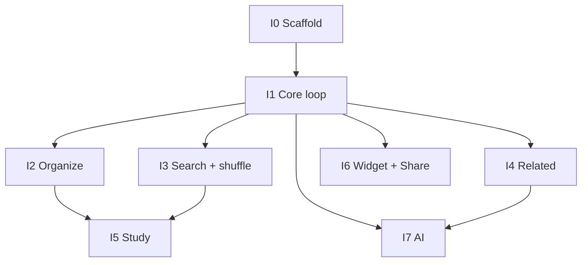

# Stage 9 — Increment Planning

**Status:** Accepted — build sequence and milestones for Development (Stage 10). Built from accepted `docs/architecture.md`, `docs/feature-breakdown.md`, and `docs/technical-design.md`.

**Refs:** `docs/architecture.md`, `docs/feature-breakdown.md`, `docs/technical-design.md`, `docs/prd.md`

---

## Why this stage

Architecture says *where* code lives. Increment Planning says *in what order* we ship vertical slices — each increment leaves a runnable app (or package) and maps cleanly to feature IDs and PRs.

---

## Planning principles

1. **Hero first** — capture → browse → card before study, extensions, and AI.
2. **Core before shells** — `GlimpseCore` store + invariants before TCA screens; screens before Widget/Share; AI last.
3. **One slice ≈ one Glimpse PR** when practical.
4. **Demo-safe cut** — after Increment 5 the personal loop works offline without AI or extensions; 6–7 are portfolio polish.
5. **No scope creep** — v1 out-of-scope list in Feature Breakdown stays out.

---

## Increments

### I0 — Scaffold (packages + app shell)

**Goal:** Empty but correct module graph; app launches into TCA root.

|              |                                                                                                                                                                                         |
| ------------ | --------------------------------------------------------------------------------------------------------------------------------------------------------------------------------------- |
| **Delivers** | `Packages/GlimpseCore`, `GlimpseAI`, `GlimpseFeatures` wired; `AppFeature` / `AppView` stub; App Group entitlement placeholder; remove template `Item` when Core models land (or in I1) |
| **Features** | **X3** partial (nav shell skeleton only)                                                                                                                                            |
| **Exit**     | Glimpse builds and shows root UI                                                                                                              |
| **Tests**    | Package targets compile; smoke test optional                                                                                                                                            |

---

### I1 — Core store + capture → browse → card

**Goal:** Personal hero loop without AI or extensions.

|              |                                                                                                                                                                                                                                             |
| ------------ | ------------------------------------------------------------------------------------------------------------------------------------------------------------------------------------------------------------------------------------------- |
| **Delivers** | Models (`VocabItem`, folders, `SchemaV1`), `ModelContainerFactory`, `VocabularyStore`, `CapturePipeline`, `LanguageDetector`, `PreferencesClient`; TCA: `FolderList`, `FolderDetail`, `CardDetail` (manual fields), `Capture` sheet; resume |
| **Features** | **X1**, **X3**, **X4**, **F1.4**, **F2.1**, **F1.1**, **F3.1**, **F4.1**                                                                                                                                                                    |
| **Exit**     | Add word in-app → lands in language/Unsorted folder → open card → edit translation/example manually → kill app → resume last folder                                                                                                         |
| **Tests**    | `GlimpseCoreTests`: create/assign/Unsorted null path; folder auto-create                                                                                                                                                                    |

---

### I2 — Organize (custom folders + Unsorted resolve)

**Goal:** Full filing rules from domain model.

|              |                                                                                                                                         |
| ------------ | --------------------------------------------------------------------------------------------------------------------------------------- |
| **Delivers** | Custom folder CRUD, re-file, default custom folder pref, Unsorted resolve UI (once per card)                                            |
| **Features** | **F2.2**, **F2.3**, **F2.5**, **F2.4**                                                                                                  |
| **Exit**     | Create custom folder; assign from capture/card; resolve Unsorted via language or custom path; default folder prefills / gates correctly |
| **Tests**    | Resolve once; custom membership ≤1; delete folder cascades membership only                                                              |

---

### I3 — Find depth (search + shuffle)

**Goal:** Find beyond folder browse.

|              |                                                                             |
| ------------ | --------------------------------------------------------------------------- |
| **Delivers** | `SearchService` + global search UI; folder-scoped shuffle entry             |
| **Features** | **F3.2**, **F3.3**                                                          |
| **Exit**     | Search hits `text` + `translation`; open result → card; shuffle from folder |
| **Tests**    | Predicate search cases; empty query behavior                                |

---

### I4 — Related items (offline)

**Goal:** Card intelligence without network.

|              |                                                                                                      |
| ------------ | ---------------------------------------------------------------------------------------------------- |
| **Delivers** | `RelatedItemsQuery` (same language, exclude self, `createdAt` desc, **cap 20**); card detail section |
| **Features** | **F4.2**                                                                                             |
| **Exit**     | Related list on card when `sourceLanguage` non-null; empty/hidden when null                          |
| **Tests**    | Cap 20; same-language filter; null source → no related                                               |

---

### I5 — Study

**Goal:** Secondary loop from folder / search scope (no tab).

|              |                                                                                          |
| ------------ | ---------------------------------------------------------------------------------------- |
| **Delivers** | `StudyFeature` + deck UI; mid-study open card; no persisted mid-deck index               |
| **Features** | **F5.1**, **F5.2**                                                                       |
| **Exit**     | “Study this folder” / study from search results; flip through deck; open card and return |
| **Tests**    | Scope carries correct IDs; relaunch does not restore mid-deck                            |

**Milestone — offline v1 demo:** I0–I5 complete the capture → organize → find → study loop without Widget, Share, or AI.

---

### I6 — Zero-tap capture (Widget + Share)

**Goal:** Measurably faster capture surfaces.

|              |                                                                                                                |
| ------------ | -------------------------------------------------------------------------------------------------------------- |
| **Delivers** | `GlimpseWidget` (App Intent) + `GlimpseShare` (SwiftUI sheet); both call `CapturePipeline` via App Group store |
| **Features** | **F1.2**, **F1.3**                                                                                             |
| **Exit**     | Save from widget and Share without opening main UI; items appear in app; default custom folder gate applied    |
| **Tests**    | Shared container write visible to app (manual + store-level where feasible)                                    |

---

### I7 — AI generation

**Goal:** On-demand study aids.

|              |                                                                                                                                                                |
| ------------ | -------------------------------------------------------------------------------------------------------------------------------------------------------------- |
| **Delivers** | `GenerationService` + hybrid adapters; Keychain key seed; card actions for translate / example / discover-similar                                              |
| **Features** | **X2**, **F4.3**, **F4.4**, **F4.5**                                                                                                                           |
| **Exit**     | Explicit tap only; multi-candidate pick for translation & discover-similar; single example save; gated on non-null `sourceLanguage`; failure leaves app usable |
| **Tests**    | Mock `GenerationService`; gate when source null; no auto-generate on load/save                                                                                 |

**Milestone — full v1:** I0–I7 = PRD v1 scope.

---

## Dependency graph

I2 and I3 can proceed in parallel after I1. I4 can start after I1 (card detail exists). I5 needs browse/search scopes (I1 + preferably I2/I3). I6 and I7 only need I1 store + capture pipeline; prefer after I5 so the demo milestone stays clean.

---

## Mapping: Feature Breakdown phases → increments

| Feature Breakdown phase  | Increment                  |
| ------------------------ | -------------------------- |
| 1 — Core loop            | **I1** (+ **I0** scaffold) |
| 2 — Organize             | **I2**                     |
| 3 — Find depth           | **I3**                     |
| 4 — Offline intelligence | **I4**                     |
| 5 — Study                | **I5**                     |
| 6 — Zero-tap capture     | **I6**                     |
| 7 — AI                   | **I7**                     |

---

## Explicitly deferred (not increments)

- Exact bundle ID / final App Group string — set in Xcode during I0/I1
- Foundation Models API confirmation — stub in I7 until SDK ready
- TCA version pin — lock in I0 `Package.swift`
- Delete-item UI placement — pick during I1 card/list implementation
- macOS target, CI/CD, TestFlight, pixel polish — Stages 11–13
- Spaced repetition, sync, OCR, chat — out of v1

---

## Non-goals (this stage)

- Writing production feature code — Stage 10.
- Test matrix / CI — Stage 11.
- Store listing / release — Stage 12.

---

## Definition of Done (Stage 9)

- [x] Ordered increments with goals, feature IDs, and exit criteria.
- [x] Dependency / parallelization called out.
- [x] Demo-safe cut (offline loop) identified.
- [x] Owner review — accepted.
- [x] Proceed to Stage 10 — Development (start **I0**).